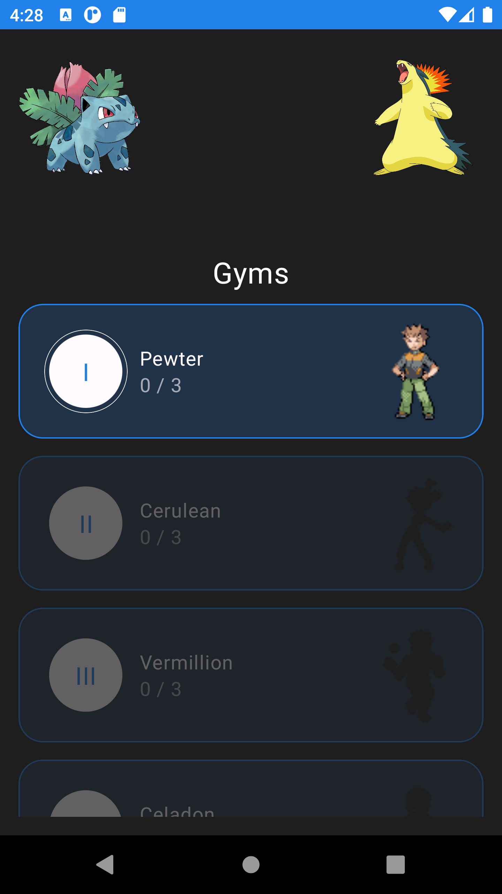
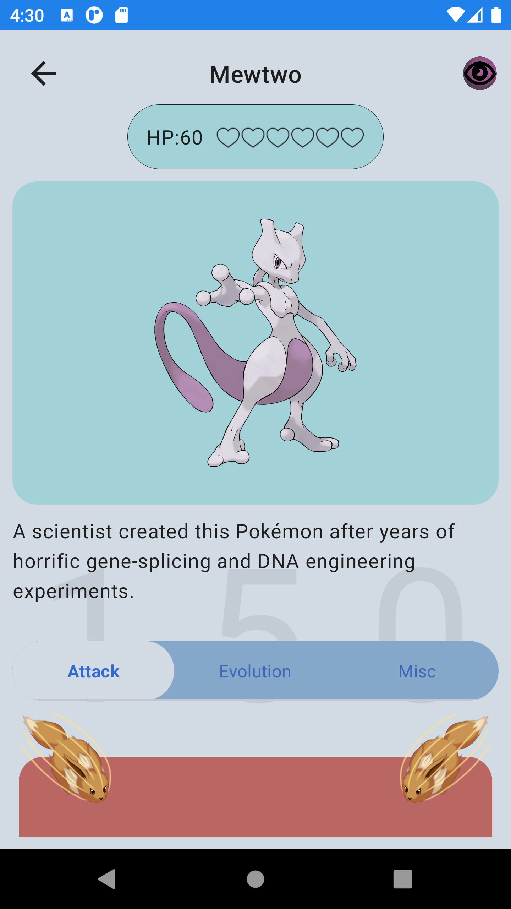
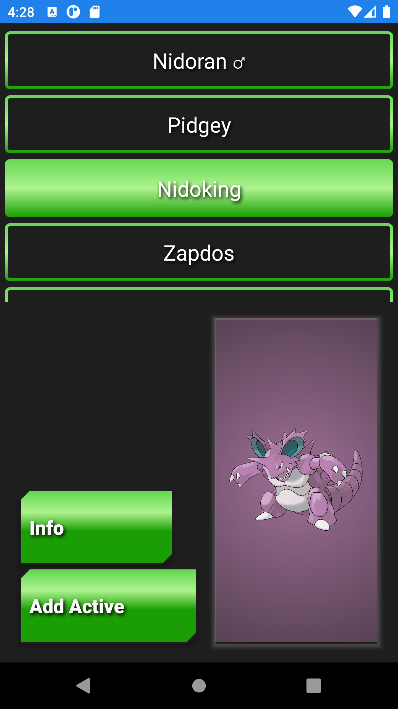
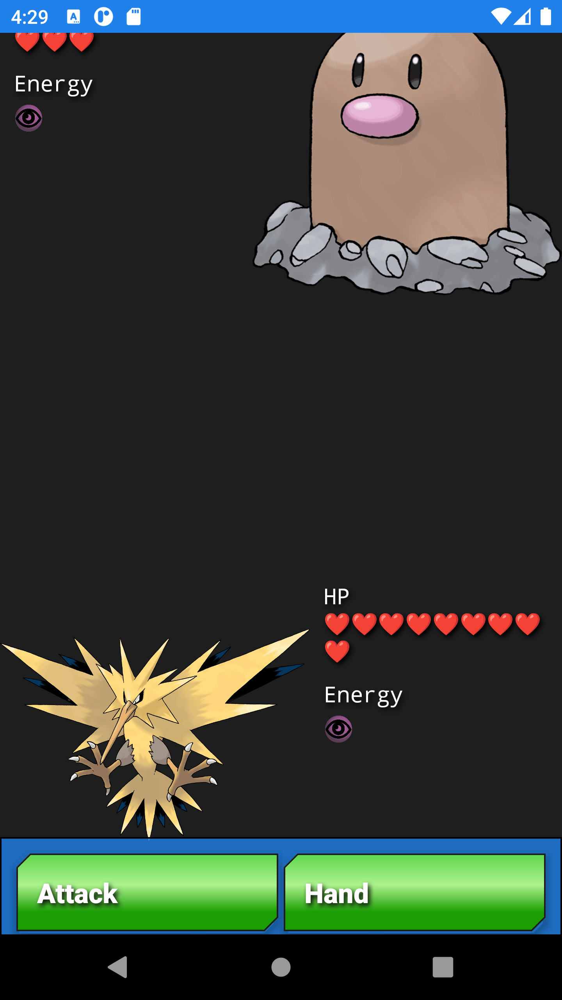
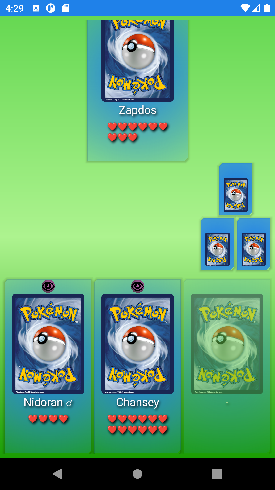

#            Pokemon Trading Card Android Game

This Android app showcases a Pokemon Trading Card Game implemented in Kotlin. It leverages various Android technologies to provide an immersive gaming experience. Below, we outline the key features and technical aspects of the project.

## Features

- **Jetpack Compose**: The app's UI is primarily designed using Jetpack Compose eliminating the need for traditional XML layouts.

- **REST API Integration**: Utilizes Retrofit to fetch Pokemon Card data from the [Pokemon TCG API](https://docs.pokemontcg.io/).

- **Dependency Injection**: Dagger Hilt is employed for efficient dependency injection across classes and use cases.

- **Local Database**: Utilizes Room Database to allow users to create and manage their decks directly on the device. Additionally, it stores gym opponent statuses, images, symbols, and names.

- **Shared Preferences**: Supports game state persistence allowing users to start a new game or resume from previous sessions.

- **Concurrency with Kotlin Flows and Coroutines**: Utilizes Kotlin Flows and Coroutines for efficient handling of asynchronous operations.

## Technical Details

### Jetpack Compose
The entire UI is built using Jetpack Compose demonstrating the power and flexibility of this modern UI toolkit.

### REST API Integration
The app fetches Pokemon Card data from the official Pokemon TCG API using Retrofit providing real-time card information to the users.

### Dagger Hilt (Dependency Injection)
Dagger Hilt is employed for managing dependencies, ensuring a clean and organized codebase.

### Room Database
Local storage is managed using Room Database, facilitating deck creation and storing gym opponent data.

### Shared Preferences
Shared Preferences is used to persist game state, enabling users to continue their progress across sessions.

### Git Version Control
The project is hosted on Github allowing for easy collaboration and version control.

## Screenshots

       

## Usage

To run the app, follow these steps:

1. Clone the repository.
2. Open the project in Android Studio.
3. Build and run the app on an Android device or emulator.
